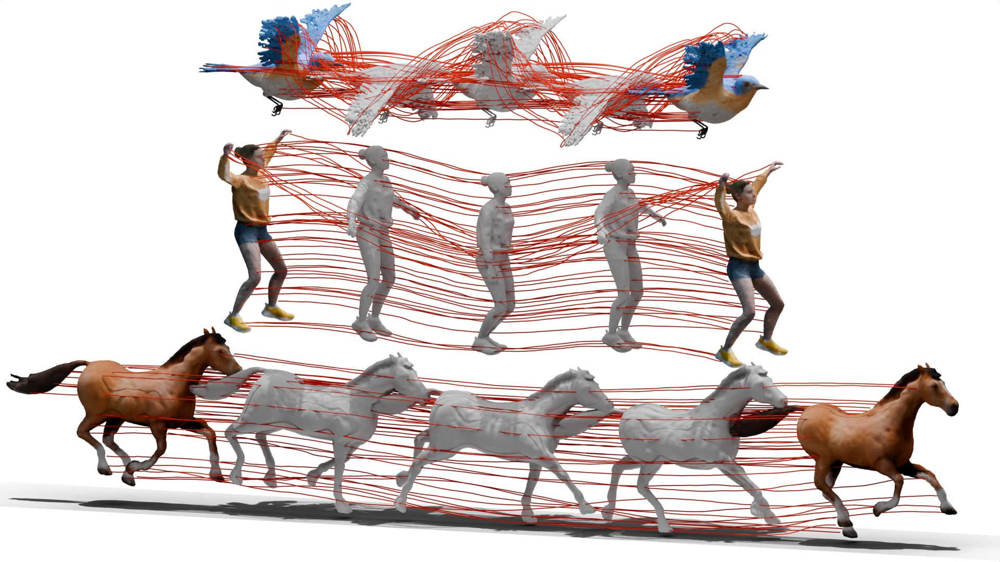

# Dynamic Gaussian Mesh

## [Project Page](https://www.liuisabella.com/DG-Mesh/) | [Paper](https://www.liuisabella.com/DG-Mesh/)

We propose DG-Mesh, a framework that reconstructs high-fidelity time-consistent mesh from monocular videos. Given monocular inputs of dynamic scenes and the camera parameters, our method reconstructs the high-quality surface and its appearance, as well as the mesh vertice motion across time frames. Our method can reconstruct mesh with flexible topology change. We can reconstruct satisfying surfaces even in challenging thin structures like bird wings.
