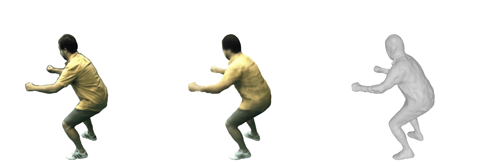
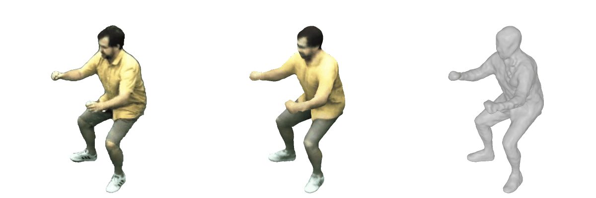

# Dynamic Gaussians Mesh

## [Project Page](https://www.liuisabella.com/DG-Mesh/) | [Paper](https://arxiv.org/abs/2404.12379)

<p align="center">
  
</p>


We propose DG-Mesh, a framework that reconstructs high-fidelity time-consistent mesh from monocular videos. Given monocular inputs of dynamic scenes and the camera parameters, our method reconstructs the high-quality surface and its appearance, as well as the mesh vertice motion across time frames. Our method can reconstruct mesh with flexible topology change. We can reconstruct satisfying surfaces even in challenging thin structures like bird wings.

## TODOs
- [x] Installation instructions
- [x] Training/inference code
- [x] Mesh evaluation code
- [x] DG-Mesh dataset
- [ ] Mesh correspondence visualization 
   


## Installation

```
conda create -n dg-mesh python=3.9
conda activate dg-mesh
conda install pytorch torchvision torchaudio pytorch-cuda=11.8 -c pytorch -c nvidia

# Install nvdiffrast
pip install git+https://github.com/NVlabs/tiny-cuda-nn#subdirectory=bindings/torch
pip install git+https://github.com/NVlabs/nvdiffrast/

# Install pytorch3d
export FORCE_CUDA=1
conda install -c fvcore -c iopath -c conda-forge fvcore iopath -y
pip install "git+https://github.com/facebookresearch/pytorch3d.git"

# Clone this repository
git clone https://github.com/Isabella98Liu/DG-Mesh.git
cd DG-Mesh

# Install submodules
pip install dgmesh/submodules/diff-gaussian-rasterization
pip install dgmesh/submodules/simple-knn

# Install other dependencies
pip install -r requirements.txt
```


## Training on the D-NeRF Dataset
We provide the config files to train our model on the [D-NeRF](https://www.dropbox.com/scl/fi/cdcmkufncwcikk1dzbgb4/data.zip?rlkey=n5m21i84v2b2xk6h7qgiu8nkg&e=1&dl=0) dataset. Download the datasets and change the `source_path` in the corresponding config files:

```
python dgmesh/train.py --config dgmesh/configs/d-nerf/jumpingjacks.yaml
```
We also provide rendering script to visualize the mesh and its rendering results, as well as the Gaussian points from the trained model. Set the `--start_checkpoint` to the path of your trained model. For example:

```
python dgmesh/render_trajectory.py --config dgmesh/configs/d-nerf/jumpingjacks.yaml --start_checkpoint outputs/d-nerf/jumpingjacks/jumpingjacks-2024-07-01_06-03-50
```

<p align="center">
  
  
</p>
<p style="text-align:center;">Example of mesh rendering results and Gaussians points on D-NeRF dataset.</p>

## Training on the DG-Mesh Dataset
To evaluate the reconstructed mesh quantitatively, we provide a synthetic dataset containing six dynamic scenes. Each scene includes 200 frames of a moving object with the ground truth camera parameters and images, as well as the ground truth mesh under each time frame. You can download the [DG-Mesh](https://drive.google.com/file/d/1yBga2DsIKG6zQK9V2WextewvhaV8Xho3/view?usp=drive_link) dataset following the link provided. The data format follows the D-NeRF dataset. 

To train the model, revise the `source_path` in the corresponding config files and run the following command: 
```
python dgmesh/train.py --config dgmesh/configs/dg-mesh/beagle.yaml
```
<p align="center">
  
  
</p>
<p style="text-align:center;">Example of mesh rendering results and Gaussians points on DG-Mesh dataset.</p>

## Training on the Nerfies Dataset
We provide part of the processed [Nerfies](https://nerfies.github.io/) data, which additionally contains the object foreground masks; you can download them [here](https://github.com/Isabella98Liu/DG-Mesh/releases/tag/datasets) in the release page. To train the model on the Nerfies dataset, run the following command:
```
python dgmesh/train.py --config dgmesh/configs/nerfies/toby-sit.yaml
```

To render the mesh under the testing camera views, run the following scripts:
```
python dgmesh/render_test.py --config /mnt/samsung990/ECCV2024/Release/DG-Mesh/dgmesh/configs/nerfies/toby-sit.yaml --start_checkpoint outputs/nerfies/toby-sit/toby-sit-2024-07-04_22-56-29 
```

<p align="center">
  
  
</p>

## Training on the NeuralActor Dataset
The [NeuralActor](https://vcai.mpi-inf.mpg.de/projects/NeuralActor/) dataset is a multi-view dynamic dataset that contains multi-view videos of moving humans. We process part of the dataset (will release the processed data if approved). To run the model on the NeuralActor dataset:
```
python dgmesh/train.py --config dgmesh/configs/neural-actor/D2_vlad.yaml
```
<p align="center">
  
  
</p>

## Training on iPhone-Captured Videos
We capture several dynamic scenes using iPhone 14 Pro and [Record3D](https://record3d.app/), and process them using the pipeline in [Reality Check](https://github.com/KAIR-BAIR/dycheck/blob/main/tools/process_record3d_to_iphone.py). We use [DEVA](https://github.com/hkchengrex/Tracking-Anything-with-DEVA) to obtain our foreground masks. You can download the data through the [link](https://github.com/Isabella98Liu/DG-Mesh/releases/tag/datasets) in the release page. To train the model on our captured data, run:
```
python dgmesh/train.py --config /dgmesh/configs/iphone/tiger.yaml
```
<p align="center">
  
</p>


## Mesh Evaluation
We provide the mesh evaluation script on the DG-Mesh dataset; please organize the mesh GT data and your mesh results like below:
```
mesh_eval_folder/
├── gt/
│   ├── objname0.obj
│   ├── objname1.obj
│   └── ...
├── DG-Mesh/
│   └── dynamic_mesh/
│       ├── frame_0.ply
│       ├── frame_1.ply
│       └── ...
└── transforms_train.json
```

You may need to install [StructuralLoss](https://github.com/stevenygd/PointFlow) to calculate the EMD; please follow the instruction below:
```
cd dgmesh/metrics/pytorch_structural_losses/
make clean
make
```
To run the evaluation:
```
python mesh_evaluation.py --path mesh_eval_folder --eval_type dgmesh
```


## Citation
If you find our code or paper helps, please consider citing:
```
@misc{liu2024dynamic,
 title={Dynamic Gaussians Mesh: Consistent Mesh Reconstruction from Monocular Videos}, 
 author={Isabella Liu and Hao Su and Xiaolong Wang},
 year={2024},
 eprint={2404.12379},
 archivePrefix={arXiv},
 primaryClass={cs.CV}
}
```
And thanks to the authors of [Deformable 3DGS](https://ingra14m.github.io/Deformable-Gaussians/) and [3DGS](https://repo-sam.inria.fr/fungraph/3d-gaussian-splatting/) for their excellent code!